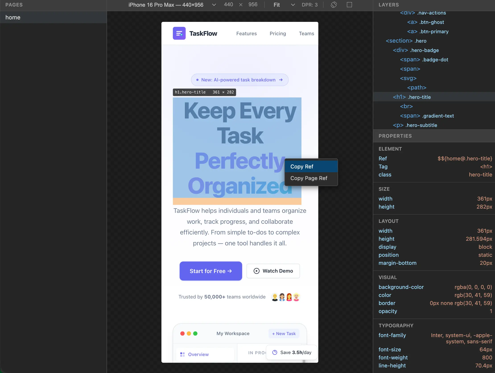

# dekit

A design canvas for AI code agents.

Agents write HTML/CSS designs, preview and screenshot them, iterate until satisfied — then humans review in the browser and give feedback.



## How It Works

1. **Agent designs** — scaffolds a project, writes HTML/CSS, takes screenshots to self-check
2. **Human reviews** — opens the browser preview, inspects elements, right-clicks to **Copy Ref**
3. **Human gives feedback** — pastes the ref in terminal with instructions
4. **Agent iterates** — resolves the ref to source code, makes changes, screenshots to verify

All design files live inside a `.dekit/` directory, keeping your project clean.

## Getting Started

### 1. Install

```bash
npm install -g dekit-cli
```

### 2. Set up your agent

Create a skill file at `.claude/skills/dekit/SKILL.md`:

```markdown
---
name: dekit
description: Use dekit to create, preview, and iterate on HTML/CSS designs
---
Run `dekit usage` to get the full usage guide.
Follow the guide to complete your design task.
```

### 3. Try it

```
> Use dekit to design a landing page for a task management app
```

## Examples

**Design for mobile:**

```
> Use dekit to design a mobile app for a fitness tracker, use the mobile template
```

**Add to an existing project:**

```
> Initialize a dekit design project using the dashboard template
```

**Review and give feedback:**

Right-click any element in the preview and **Copy Ref**, then tell the agent:

```
> The hero section $${home@.hero} needs more padding, and make the CTA button blue
```

**Add pages and components:**

```
> Add a pricing page with a 3-tier card layout
> Create a ui-card component with an image slot and body slot
```

## License

[Apache 2.0](LICENSE)
